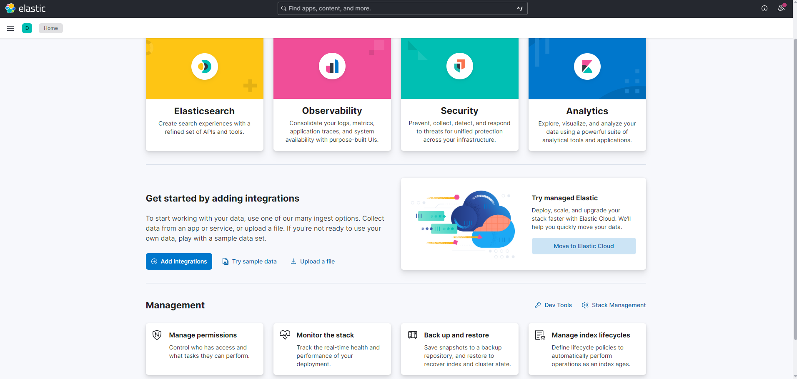
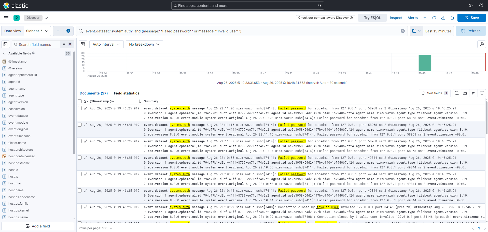
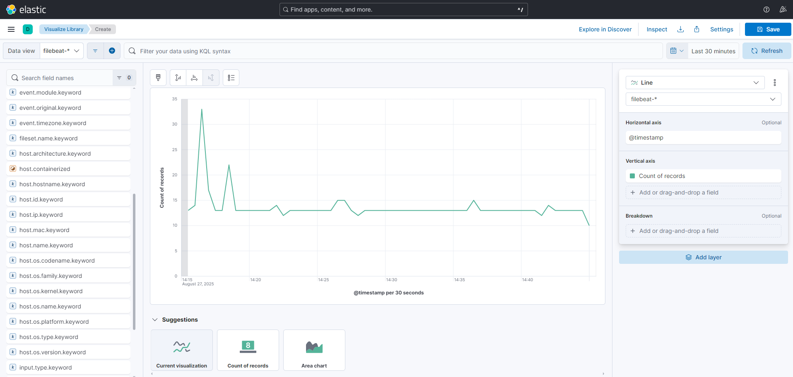
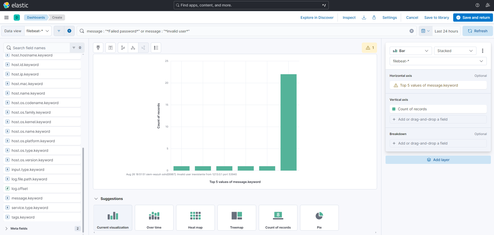

# ELK Lab (Elasticsearch + Kibana + Logstash + Filebeat)

Laboratório em Ubuntu Server com ingestão via Filebeat → Logstash → Elasticsearch e visualização no Kibana.

---

## 🔍 Preview do Dashboard



---

## Objetivos
- Centralizar e visualizar logs do sistema em um ambiente de laboratório.
- Criar dashboards básicos de falhas de autenticação SSH.
- Documentar a instalação, configuração e troubleshooting.

---

## Arquitetura
Filebeat → Logstash → Elasticsearch → Kibana

---

## ⚙️ Setup resumido
1. **Elasticsearch**
   - Config em `/etc/elasticsearch/elasticsearch.yml`
   - Teste: `curl http://127.0.0.1:9200`

2. **Kibana**
   - Config em `/etc/kibana/kibana.yml`
   - Acesso: `http://<IP_VM>:5601`

3. **Logstash**
   - Pipeline em `/etc/logstash/conf.d/01-beats.conf`
   - Porta Beats: `5044`

4. **Filebeat**
   - Config saída para Logstash em `/etc/filebeat/filebeat.yml`
   - Módulo **system** habilitado (`syslog` e `auth`)
   - Serviço ativo: `systemctl status filebeat`

---

## 🔍 Descoberta de eventos (Discover no Kibana)
Data view: **filebeat-***  
Filtro de tempo: **Last 15 minutes**  

### Query KQL utilizada
```kql
event.dataset:"system.auth" and (message:"*Failed password*" or message:"*Invalid user*")
```


---

## 📊 Dashboards SSH no Kibana

Criamos visualizações no **Kibana Lens** para monitorar tentativas de login SSH inválidas.  

- **SSH_Failed_Logins_Over_Time** → gráfico de linha mostrando evolução das falhas de login.  
  

- **SSH_Top_Messages** → gráfico de barras exibindo as principais mensagens capturadas do `auth.log`.  
  

📌 Documentação detalhada: [Dashboards SSH no Kibana](docs/04-kibana-ssh-dashboards.md)

---

## Serviços e portas
- Kibana: 5601
- Elasticsearch: 9200
- Logstash (Beats): 5044

---

## Documentação
- [Setup](docs/01-setup.md)
- [SSH Failures (Discover)](docs/02-discover-ssh-failures.md)
- [Dashboards no Kibana](docs/02-kibana-dashboards.md)
- [Troubleshooting](docs/03-troubleshooting.md)
- [Dashboards SSH no Kibana](docs/04-kibana-ssh-dashboards.md)


